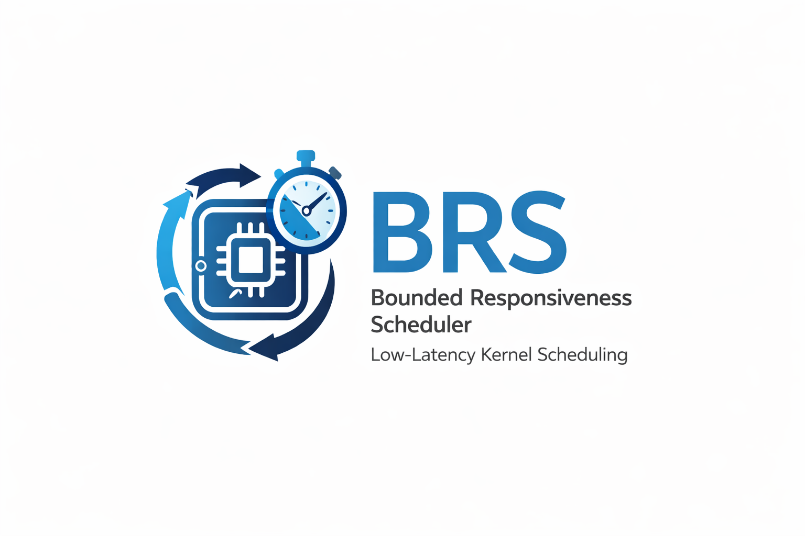

# SCHED_BRS Artifact (Reproduction Package)
<p align="center">
  
</p>

This repository is a faithful, **runnable** reproduction package for the paper
*"Practical Bounded Responsiveness Scheduling for Low-Latency Mobile Systems."*
It contains a discrete-event simulator of the Bounded Responsiveness Scheduler
(BRS), a benchmark harness, the design-of-experiments and adversarial studies,
controller-adaptation traces, a synthetic-dataset generator, a unit/regression
test suite, and illustrative kernel-patch sketches showing how the bias hooks
integrate into CFS.

Exact numbers differ from real-kernel measurements, but the **mechanism** and
the **trends** match the paper: interactive (high-B) tasks get lower wake-to-run
tail latency, fairness stays above the floor (Jain's index ≥ 0.96), and
starvation stays bounded.

## Core mechanism

BRS makes interactive tasks accumulate virtual runtime *more slowly* so they are
selected earlier, with a strictly bounded bias (Eq. 2):

```
vruntime_i += Δt · (1 − α · B_i)
```

Because `1 − α·B_i ∈ [1 − α_max, 1] = [0.65, 1.0]` is strictly positive,
vruntime stays monotone and per-task CPU share deviates from CFS by at most
`1/(1 − α_max) ≈ 1.54×` (Definition 1 / Lemma 1). The interactivity score
`B_i ∈ [0,1]` is the convex combination `0.5·sleep + 0.3·iowait + 0.2·wake_hist`
over a sliding window (W=64), EWMA-smoothed (ρ=0.25) — Section IV-C. Selection
uses the interactivity-aware tie-break `argmin_i (vruntime_i − β·B_i)`
(Section IV-D), and a hybrid controller adjusts (α,β) each control period with a
fairness/starvation guardrail and an aging (starvation-shield) force-promotion
(Section IV-F).

## What's inside
- `sched_brs_sim/` — the simulator: `interactivity.py` (B_i), `scheduler.py`
  (Eq. 2, tie-break, hybrid controller, aging guardrail; `static`/`adaptive`/
  `hybrid` modes, with `α=β=0` static emulating CFS), `workloads.py`
  (saturated representative workloads), `metrics.py`, `telemetry.py`.
- `benchmarks/` — five workload benchmarks plus `adversarial.py`
  (Sec IV-G/V-I), driven by `_common.py`, which scores three policies per
  workload — CFS (α=β=0), a BFS/MuQSS-like low-latency reference (α=0.30,
  β=0.25 static), and BRS (α=0.20, β=0.15 hybrid, Table I defaults) — over
  12k steps; `run_all.sh` emits CSVs to `results/`.
- `scripts/`
  - `analyze_results.py` — per-workload P95 (interactive/all/background),
    Jain, starvation, and BRS-vs-CFS P95 reduction.
  - `doe_sweep.py` — Section IV-I 5×5 DOE, surrogate fits (Eq. 4/5) with R²,
    held-out validation, and the closed-form Lagrangian optimum (Eq. 6).
  - `gen_synth.py` — Section V-C synthetic 500k-token dataset (log-normal
    mean 512, sd 128, seed 42).
  - `log_adaptation.py` — Section V-H controller-adaptation traces across
    idle→gaming→mixed transitions, written to `results/adaptation/`.
- `tests/` — unit/regression tests for the Def. 1 bound, Lemma 1, `B_i ∈ [0,1]`,
  the Eq. 2 sign, CFS reduction, and the fairness floor.
- `kernel_patches/` — a single illustrative diff (`sched_brs.patch`) with the
  CFS touch points and `/proc/sys/sched_brs` knobs.
- `kernel_patches_mvp/` — a 9-part illustrative patch series (framework,
  vruntime biasing, hybrid controller, mitigations + aging guardrail, NUMA,
  tracing, docs, cleanup).
- `ci/run_tests.sh` — compiles sources, runs the test suite, benchmarks, DOE,
  adaptation traces, and the dataset generator.
- `results/` — generated CSVs, JSON summaries, and adaptation traces.
- `LICENSE.md` — Apache-2.0.

## Quick start
```bash
python3 -m venv .venv && source .venv/bin/activate   # optional
export PYTHONPATH="$PWD"

# Benchmarks -> results/*.csv
bash benchmarks/run_all.sh

# Summary (per-workload P95, fairness, BRS-vs-CFS reduction)
python scripts/analyze_results.py --input results --out results/summary.json

# Full paper-artifact pipeline (tests + DOE + adaptation + dataset)
bash ci/run_tests.sh
```

Representative simulator output (12k steps): interactive-class P95 falls ~21–33%
vs the CFS baseline across workloads with Jain's index ≥ 0.96 and ~0% starvation
— the same direction as the paper's −35.2%/−37.8% headline, at simulator scale.

## Individual studies
```bash
python scripts/doe_sweep.py        # surrogate R^2 + closed-form (α*, β*)
python benchmarks/adversarial.py   # adversary CPU share vs CFS, worst slowdown < 1.54x
python scripts/log_adaptation.py   # (α,β,J,S) trajectories; settles in 3–5 periods
python scripts/gen_synth.py        # results/synth_tokens.txt (+ summary)
python -m unittest discover -s tests -v
```

## Kernel patch sketches
The patches are **illustrative** pseudo-C, not build-ready. `kernel_patches/sched_brs.patch`
shows the vruntime scaling `scale = 10000 − α·B` (fixed-point form of Eq. 2),
the tie-break, and the aging guardrail inside `kernel/sched/fair.c`, plus the
`/proc/sys/sched_brs/*` interface. The `kernel_patches_mvp/` series breaks the
same logic into an ordered patch set. Replace with a production patch when ready.

## Folder structure
```
sched_brs-main/
├─ README.md
├─ LICENSE.md
├─ kernel_patches/
│  └─ sched_brs.patch
├─ kernel_patches_mvp/
│  ├─ 0000..0008-sched-BRS-*.patch
│  └─ README.md
├─ sched_brs_sim/
│  ├─ __init__.py  interactivity.py  scheduler.py
│  ├─ workloads.py  metrics.py  telemetry.py
├─ benchmarks/
│  ├─ _common.py  run_all.sh
│  ├─ interactive.py  gaming.py  ai_inference.py
│  ├─ data_analytics.py  streaming.py  adversarial.py
├─ scripts/
│  ├─ analyze_results.py  doe_sweep.py
│  ├─ gen_synth.py  log_adaptation.py  run_gui_redraw.sh
├─ tests/
│  └─ test_bounds.py
├─ ci/
│  └─ run_tests.sh
└─ results/
   └─ .gitkeep
```

## License
Apache-2.0. See `LICENSE.md`.
